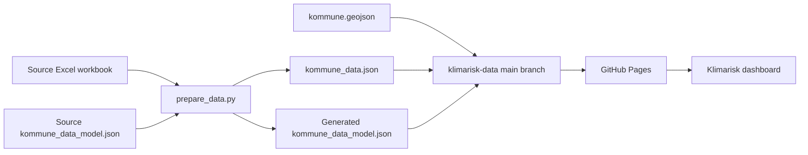

# Klimarisk data maintainer guide

This guide describes how to update the municipality climate-risk data used by the [Klimarisk dashboard](https://tiltobias.github.io/klimarisk/). It is intended for data maintainers and does not require changes to the dashboard frontend.

The dashboard supports:

- one or more years;
- one or more determinants;
- one or more indicators in each determinant; and
- changes to names, descriptions, ordering, and indicator composition.

The update workflow uses two source files:

1. an Excel workbook containing the municipality values; and
2. a source `kommune_data_model.json` describing the years, risk concept, determinants, and indicators.

These files are processed with `prepare_data.py` from the [Klimarisk application repository](https://github.com/tiltobias/klimarisk). The generated files are published in this repository.

> The source model and the generated model have the same filename: `kommune_data_model.json`. Keep them in separate folders. Edit the source model, not the generated copy in this repository.

## Workflow overview



`kommune.geojson` is maintained separately and is not generated by `prepare_data.py`.

## 1. Update the source data model

The source `kommune_data_model.json` controls the structure and text shown in the dashboard. Its root structure is:

```json
{
  "years": [],
  "risk": {},
  "determinants": []
}
```

Only the properties documented below should be added unless the preprocessing script and dashboard code are also updated.

### Root properties

| Property | Status | Description |
| --- | --- | --- |
| `years` | Required | Array of year objects. Include at least one year. |
| `risk` | Required | Name and description of the total climate-risk value. |
| `determinants` | Required | Array of determinant objects. Include at least one determinant. |

### Year properties

| Property | Status | Description |
| --- | --- | --- |
| `key` | Required | Unique string identifying the year or time period, for example `"2025"`. It is also used in Excel sheet and column names. |
| `name` | Required | Display name in every dashboard language. Currently this means both `no` and `en`. |
| `description` | Expected | Short description in every dashboard language, for example reference period, near future, or distant future. |

The order of the year objects controls their order in the dashboard. The final year in the array is used as the default selected time period.

### Risk properties

The root `risk` object describes the total climate-risk metric. It does not have its own `key`.

| Property | Status | Description |
| --- | --- | --- |
| `name` | Required | Display name in every dashboard language. |
| `description` | Expected | Description in every dashboard language. |

### Determinant properties

| Property | Status | Description |
| --- | --- | --- |
| `key` | Required | Unique string identifying the determinant. |
| `name` | Required | Display name in every dashboard language. |
| `description` | Expected | Description in every dashboard language. |
| `inverted` | Optional | Boolean. Set to `true` when the determinant's direction must be inverted in dashboard calculations. Omission is equivalent to `false`. |
| `indicators` | Required | Array containing at least one indicator object. |

The order of the determinant objects controls their order in the dashboard.

### Indicator properties

| Property | Status | Description |
| --- | --- | --- |
| `key` | Required | Unique string identifying the indicator. It must be unique across the entire model, not only within its determinant. |
| `name` | Required | Display name in every dashboard language. |
| `description` | Expected | Description in every dashboard language. |
| `url` | Optional, recommended | Link to the indicator's detailed explanation in the official StoryMap. The dashboard functions without it. |
| `inverted` | Optional | Boolean. Set to `true` when the indicator's direction must be inverted in dashboard calculations. Omission is equivalent to `false`. |

The order of the indicator objects controls their order within the determinant.

### Key rules

Keys connect the JSON model, Excel workbook, generated data, and dashboard. Treat them as stable identifiers.

- Use only ASCII letters, digits, underscores (`_`), and hyphens (`-`).
- Avoid spaces, `æ`, `ø`, `å`, accented characters, and other symbols.
- Keys are case-sensitive. Do not change their capitalization accidentally.
- Every year key must be unique.
- Every determinant key must be unique.
- Every indicator key must be unique across all determinants.
- Changing an indicator or year key also requires renaming the corresponding Excel sheets or columns.

Names and descriptions may use normal Norwegian and English characters, including `æ`, `ø`, and `å`.

### Languages

Every `name` object must contain all languages supported by the dashboard. Descriptions should use the same language set.

The currently supported language keys are:

```json
{
  "no": "Norwegian Bokmål text",
  "en": "English text"
}
```

Do not add a new language only to the data model. The dashboard application must also be updated to support it.

### Inversion

Set an inversion flag as a JSON boolean:

```json
"inverted": true
```

Do not write `"true"` as a string. Omitting `inverted` has the same effect as:

```json
"inverted": false
```

### Example model

This example contains one year, one determinant, and one indicator:

```json
{
  "years": [
    {
      "key": "2025",
      "name": {
        "no": "2025",
        "en": "2025"
      },
      "description": {
        "no": "Referanseperiode",
        "en": "Reference period"
      }
    }
  ],
  "risk": {
    "name": {
      "no": "Total risiko",
      "en": "Total risk"
    },
    "description": {
      "no": "Samlet indeks for klimarisiko.",
      "en": "Composite index of climate risk."
    }
  },
  "determinants": [
    {
      "key": "f",
      "name": {
        "no": "Fare",
        "en": "Hazard"
      },
      "description": {
        "no": "Samlet fare.",
        "en": "Combined hazard."
      },
      "indicators": [
        {
          "key": "fFlom",
          "name": {
            "no": "Flomfare",
            "en": "Flood hazard"
          },
          "description": {
            "no": "Kort norsk beskrivelse.",
            "en": "Short English description."
          },
          "url": "https://example.org/indicator"
        }
      ]
    }
  ]
}
```

## 2. Check the JSON syntax

JSON has strict formatting rules:

- property names and text values must use double quotes;
- objects use `{}` and arrays use `[]`;
- properties are separated by commas;
- trailing commas are not allowed;
- comments are not allowed;
- booleans are written as `true` or `false` without quotes; and
- brackets, braces, and quotation marks must be correctly paired.

A code editor normally highlights syntax errors. Otherwise, paste the model into [JSONLint](https://jsonlint.com/) before running the preprocessing script.

A valid JSON file can still contain invalid model content. Also check the required properties, languages, unique keys, and matching Excel names.

## 3. Prepare the Excel workbook

The input must be an `.xlsx` workbook with one sheet for every year in the data model.

### Sheet names

Each sheet must use this exact name:

```text
KomRang_<yearKey>
```

Examples:

```text
KomRang_2025
KomRang_2050
KomRang_2100
```

`<yearKey>` must exactly match the corresponding `key` in the `years` array. Sheet names are case-sensitive in the preprocessing workflow.

### Required columns in every year sheet

Each sheet must contain:

| Column | Content |
| --- | --- |
| `iKomNr` | Municipality number. Use the official four-digit municipality code; storing it as text is safest for codes beginning with `0`. |
| `KomNavn` | Municipality name. |
| `<indicatorKey>_<yearKey>_0_100` | Value for each indicator defined in the data model. |

For example, indicator `fFlom` in year `2050` requires:

```text
fFlom_2050_0_100
```

Every year sheet must contain a column for every indicator in the data model, regardless of which determinant contains it. Column names must match exactly, including capitalization.

The indicator values are expected to use the dashboard's normalized 0–100 scale.

### Workbook checks

Before running the script, confirm that:

- every year in the JSON model has one matching sheet;
- there are no extra spaces in sheet or column names;
- every sheet contains `iKomNr` and `KomNavn`;
- every sheet contains all required indicator columns;
- municipality numbers are valid and consistent between sheets; and
- every municipality number has a corresponding geometry in `kommune.geojson`.

## 4. Install Python and the script requirements

Install a current Python 3 version if Python is not already available.

Open a terminal in the folder containing `prepare_data.py` and `requirements.txt`, then run:

```bash
python --version
python -m pip install -r requirements.txt
```

On Windows, `py` may be used instead:

```bash
py --version
py -m pip install -r requirements.txt
```

The installation normally only needs to be repeated when Python, the environment, or `requirements.txt` changes.

## 5. Set the file paths in `prepare_data.py`

Open `prepare_data.py` in a text editor and find the path settings near the top of the script. Update the paths for:

1. the source Excel workbook;
2. the source `kommune_data_model.json`; and
3. the output folder for the generated files.

Keep the existing Python syntax and replace only the path values. The output folder should be the local root folder of this `klimarisk-data` repository.

Because the source and generated models share the same filename, do not place the editable source model in the output folder.

## 6. Run the preprocessing script

Run the script from its folder:

```bash
python prepare_data.py
```

Or on Windows:

```bash
py prepare_data.py
```

A successful run must create these files:

```text
kommune_data.json
kommune_data_model.json
```

Place both generated files in the root of the local `klimarisk-data` repository.

Do not fix generated output by hand. Correct the source workbook or source model and run the script again.

## 7. Check the generated files

Before publishing, confirm that:

- both generated files exist and contain data;
- `kommune_data_model.json` has the expected years, determinants, indicators, names, and descriptions;
- `kommune_data.json` contains all expected years and municipalities;
- municipality numbers retain four digits;
- the number of municipalities is plausible for every year; and
- the script did not report missing sheets, columns, or invalid values.

Opening the generated JSON files in a code editor or browser is usually sufficient for a basic inspection.

## 8. Update `kommune.geojson` only when required

The existing `kommune.geojson` can normally be reused. Replace it when:

- municipality boundaries change;
- municipalities merge or split;
- the number or identifiers of municipalities change; or
- an `iKomNr` in the Excel workbook no longer has a matching geometry.

### Required GeoJSON structure

The file must:

- be named `kommune.geojson`;
- be a GeoJSON `FeatureCollection`;
- contain one municipality feature per municipality;
- use `Polygon` or `MultiPolygon` geometries;
- use WGS 84 longitude/latitude coordinates (`EPSG:4326`);
- contain a `kommunenummer` property on every feature; and
- store `kommunenummer` as a four-character string, not an integer.

Example:

```json
{
  "type": "Feature",
  "properties": {
    "kommunenummer": "0301"
  },
  "geometry": {
    "type": "MultiPolygon",
    "coordinates": []
  }
}
```

The geometry property and Excel column must match:

```text
GeoJSON kommunenummer == Excel iKomNr
```

### File size and simplification

Keep `kommune.geojson` below 25 MiB so it can be uploaded through GitHub's web interface and remains practical for the dashboard to load.

One suitable ArcGIS Pro workflow is:

1. simplify municipality polygons with **Simplify Polygon**;
2. use the Douglas–Peucker algorithm with a tolerance of approximately 25 metres;
3. remove polygon parts smaller than approximately 25,000 m², such as small islands that are not visible at dashboard scale;
4. export the result as WGS 84 GeoJSON; and
5. confirm that `kommunenummer` is still a four-character string.

Use a coordinate system measured in metres while applying metre-based tolerances, then export the final GeoJSON in WGS 84.

Do not simplify so aggressively that important coastlines, boundaries, or municipality shapes become misleading.

## 9. Publish the three required files

The root of the `main` branch must contain:

```text
kommune_data.json
kommune_data_model.json
kommune.geojson
```

To update them through the GitHub website:

1. open the `klimarisk-data` repository;
2. make sure the selected branch is `main`;
3. choose **Add file → Upload files**;
4. upload the new files using the exact filenames above;
5. enter a short commit message, such as `Update municipality data for 2027`; and
6. commit the changes directly to `main`.

GitHub Pages should then publish the updated files automatically. The dashboard fetches the published files without requiring a new frontend deployment.

The files are served from:

```text
https://tiltobias.github.io/klimarisk-data/kommune_data.json
https://tiltobias.github.io/klimarisk-data/kommune_data_model.json
https://tiltobias.github.io/klimarisk-data/kommune.geojson
```

Allow a few minutes for deployment and caching before testing.

## 10. Verify the dashboard

Open the [live dashboard](https://tiltobias.github.io/klimarisk/) and check at least the following:

- the dashboard loads without an error;
- every expected year appears in the correct order;
- the final year is selected by default;
- determinants and indicators appear in the intended order;
- Norwegian and English names and descriptions are present;
- municipality names and values are available;
- the map contains every municipality;
- selecting different years and indicators updates all views; and
- inverted determinants or indicators behave in the intended direction.

Use a hard refresh if an older version appears to be cached.

## Troubleshooting

| Problem | Most likely cause |
| --- | --- |
| JSON cannot be opened or the script reports a parse error | Invalid JSON syntax, often a trailing comma, missing quote, or unmatched bracket. |
| A year sheet is not found | The sheet is not named exactly `KomRang_<yearKey>`. |
| An indicator column is not found | The indicator key, year key, or capitalization does not match the model. |
| One indicator is missing or overwritten | Indicator keys are duplicated across determinants. |
| Oslo or another municipality is missing | A leading zero was lost, or `iKomNr` does not match the GeoJSON `kommunenummer`. |
| A municipality has no map geometry | The GeoJSON is outdated or its `kommunenummer` property is missing or incorrect. |
| The dashboard still shows old data | GitHub Pages has not finished deploying, or the browser is using a cached response. |
| Text is missing in one language | The corresponding `no` or `en` property is missing. |
| Values have the wrong risk direction | An `inverted` flag is missing, incorrectly placed, or set on the wrong object. |

## Final checklist

- [ ] Source JSON is valid.
- [ ] All names and descriptions contain both `no` and `en`.
- [ ] Year, determinant, and indicator keys are unique and use safe characters.
- [ ] Every year has a matching `KomRang_<yearKey>` sheet.
- [ ] Every sheet contains `iKomNr`, `KomNavn`, and every indicator column.
- [ ] `prepare_data.py` runs successfully.
- [ ] New `kommune_data.json` and `kommune_data_model.json` files were generated.
- [ ] `kommune.geojson` still matches all municipality numbers.
- [ ] All three files are in the repository root on `main`.
- [ ] GitHub Pages has deployed the changes.
- [ ] The live dashboard has been checked in Norwegian and English.
